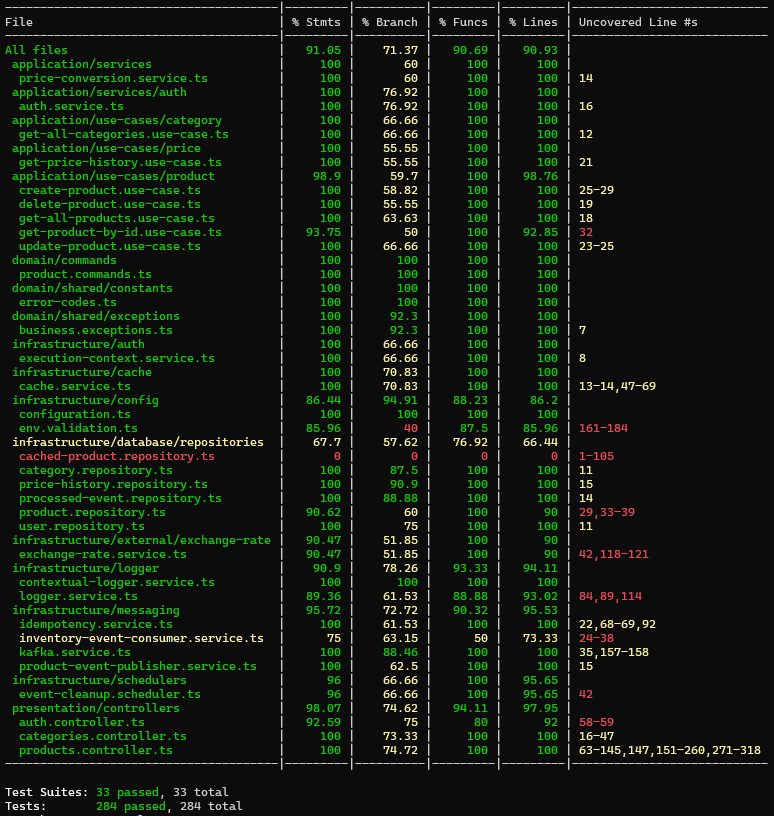
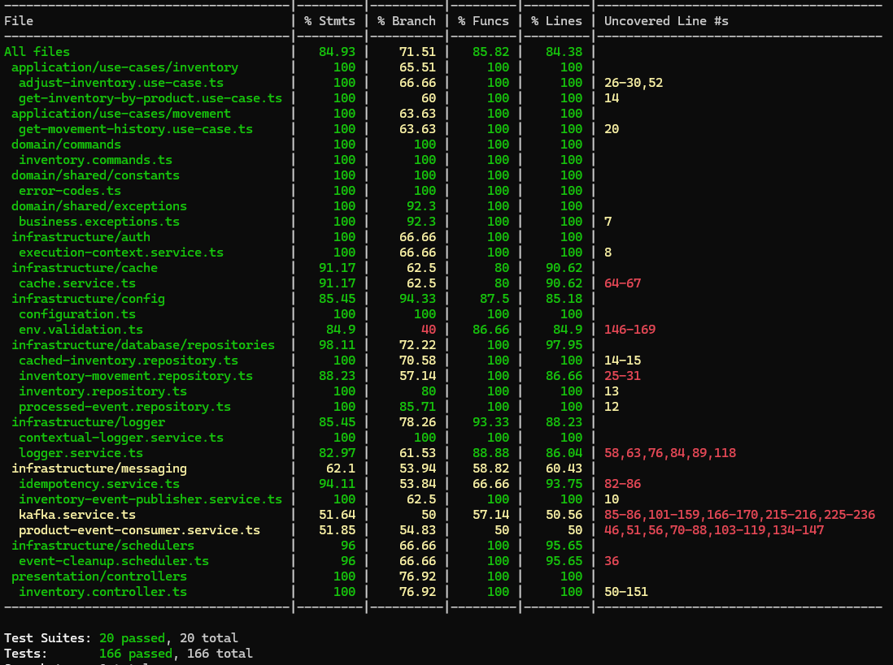
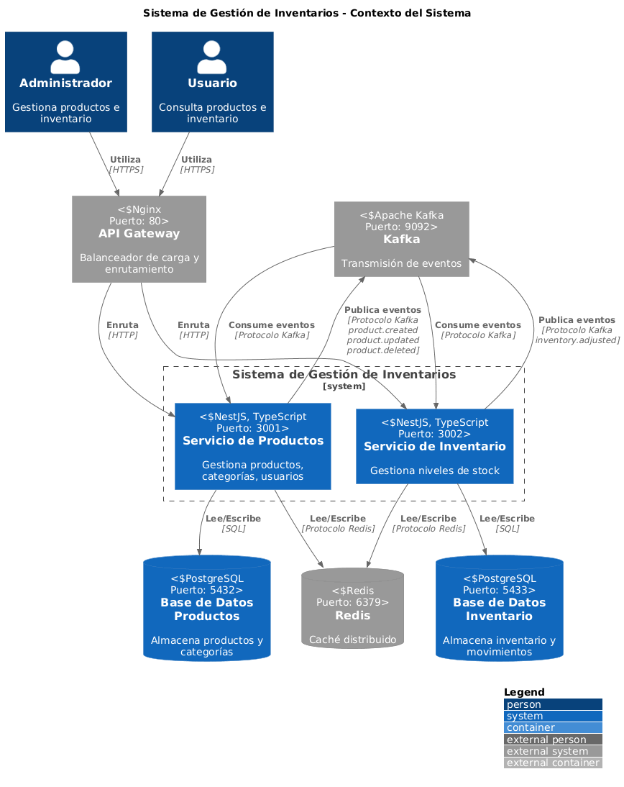
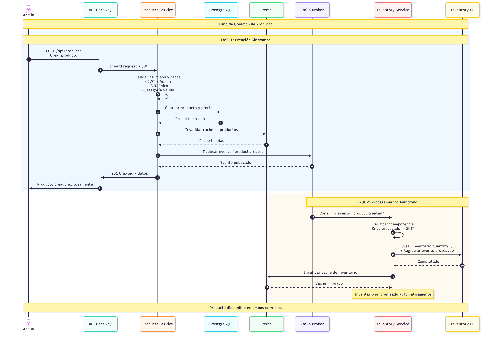
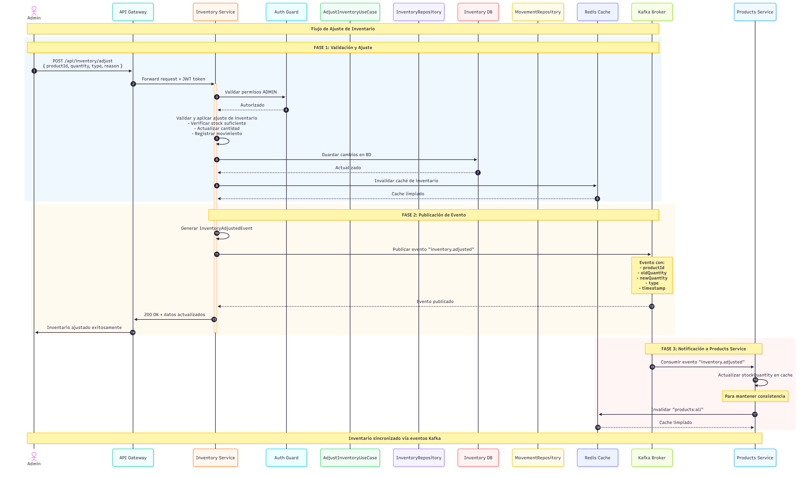

# SGI-BR

Una solución moderna y escalable mediante microservicios, implementada con arquitectura DDD (Domain-Driven Design) y comunicación basada en eventos.

## Tabla de Contenidos

- [Inicio Rápido](#inicio-rápido)
- [Arquitectura de la Solución](#arquitectura-de-la-solución)
- [Consideraciones de Diseño](#consideraciones-de-diseño)
- [Tecnologías Utilizadas](#tecnologías-utilizadas)
- [Endpoints de la API](#endpoints-de-la-api)
- [Pruebas](#pruebas)
- [Diagramas](#diagramas)

## Inicio Rápido

### Requisitos del Sistema

- **Docker**: Versión 20.10 o superior
- **Docker Compose**: Versión 2.0 o superior

### Pasos de Instalación

**Iniciar todos los servicios con Docker Compose**:

```bash
docker-compose up -d
```

**Verificar que todos los servicios estén corriendo**:

```bash
docker-compose ps
```

Todos los servicios deberían estar en estado "Up". Si hay algún problema:

```bash
docker-compose logs -f nombre-del-servicio
```

**Esperar a que las migraciones y seeds se completen**:

```bash
# Ver logs de products service
docker-compose logs -f products-service

# Ver logs de inventory service
docker-compose logs -f inventory-service
```

**Verificar que los servicios están listos**:

```bash
curl http://localhost/health
```

Debe retornar: `healthy`

### Acceso a los Servicios

Una vez que todo esté corriendo, puedes acceder a:

| Servicio               | URL                                 | Descripción                        |
| ---------------------- | ----------------------------------- | ---------------------------------- |
| **API Gateway**        | http://localhost                    | Punto de entrada principal         |
| **Products API Docs**  | http://localhost/api/products/docs  | Documentación Swagger de Products  |
| **Inventory API Docs** | http://localhost/api/inventory/docs | Documentación Swagger de Inventory |
| **Kafka UI**           | http://localhost:8080               | Interfaz para gestionar Kafka      |
| **Redis Commander**    | http://localhost:8081               | Interfaz para gestionar Redis      |

### Probar con Postman

Hay una colección de Postman completa en el proyecto:

**Ubicación**: `postman/Inventory-System.postman_collection.json`

**Pasos para importar**:

- Abre Postman
- Click en "Import" (arriba a la izquierda)
- Selecciona "Upload Files"
- Navega a `postman/Inventory-System.postman_collection.json`
- Importa la colección

**Uso de la colección**:

- La colección incluye ejemplos de todas las operaciones
- Variables pre-configuradas para `base_url` y `token`
- Ejemplos de requests para todas las funcionalidades
- Orden lógico de ejecución (login → operaciones)

**Variables de entorno en Postman**:

```json
{
  "base_url": "http://localhost",
  "token": "{{tu_token_jwt_aqui}}"
}
```

### Detener los Servicios

Para detener todos los servicios:

```bash
docker-compose down
```

Para detener y eliminar los volúmenes (datos de BD):

```bash
docker-compose down -v
```

## Arquitectura de la Solución

El sistema implementa una arquitectura de microservicios basada en Domain-Driven Design (DDD), donde cada servicio está organizado en capas bien definidas:

### Capas de Arquitectura DDD

#### Domain (Dominio)

- **Entidades**: Representan los conceptos de negocio (Product, Inventory, Category, etc.)
- **Repositories (Interfaces)**: Definiciones de contratos para persistencia
- **Domain Services**: Lógica de negocio que no pertenece a una entidad específica
- **Events**: Eventos de dominio que representan cambios de estado
- **Commands**: Comandos que representan intenciones de cambio

#### Application (Aplicación)

- **Use Cases**: Casos de uso que orquestan la lógica de negocio
- **Application Services**: Servicios de aplicación que coordinan múltiples use cases
- **DTOs**: Objetos de transferencia de datos

#### Infrastructure

- **Database**: Implementación de repositorios con TypeORM y PostgreSQL
- **Messaging**: Implementación de Kafka para eventos
- **Cache**: Implementación de Redis para caché distribuido
- **Auth**: Implementación de JWT y Passport
- **Config**: Configuración centralizada
- **Logger**: Logging estructurado
- **External Services**: Integración con APIs externas (tipos de cambio)

#### Presentation

- **Controllers**: Endpoints REST
- **DTOs**: Objetos de transferencia de datos
- **Filters**: Manejo de excepciones globales

### Comunicación entre Servicios

Los microservicios se comunican de forma asíncrona mediante Apache Kafka:

**Products Service** publica eventos cuando:

- Se crea un nuevo producto
- Se actualiza un producto existente
- Se elimina un producto

**Inventory Service** consume estos eventos para:

- Crear registros de inventario automáticamente
- Actualizar información del producto en inventario
- Desactivar inventario cuando se elimina un producto

### Idempotencia de Eventos

El sistema garantiza la idempotencia mediante:

- **Processed Events Table**: Registro de eventos ya procesados
- **Event ID Hashing**: Generación de IDs únicos basados en el contenido del evento
- **Skipped Events**: Los eventos duplicados se detectan y se omiten automáticamente

### Caché Estratégica

Se implementa caché en múltiples niveles:

- **Consultas frecuentes**: Lista de productos, categorías, inventario
- **Tipos de cambio**: Tasas de conversión de moneda
- **Productos por categoría**: Resultados de búsquedas filtradas
- **Invalidación inteligente**: El caché se invalida cuando se modifican los datos

### Estrategia de Idempotencia

**Problema**: En sistemas distribuidos, eventos pueden duplicarse por redes inestables o restart de consumers.

**Solución implementada**:

```typescript
// Tabla processed_events con evento_id único (hash SHA-256)
// Antes de procesar: Verificar si eventId existe
// Si existe: SKIP
// Si no: Procesar y registrar como SUCCESS/FAILED
```

**Event ID generation**:

- Hash SHA-256 de: `eventType + timestamp + data`
- Garantiza unicidad incluso si Kafka reenvía el mismo evento

## Consideraciones de Diseño

### Arquitectura DDD (Domain-Driven Design)

**Justificación**: Facilita la mantenibilidad, escalabilidad y comprensión del código mediante una clara separación de responsabilidades.

**Beneficios**:

- Código de negocio independiente de frameworks
- Fácil testing (capa de dominio 100% testeable)
- Documentación implícita de reglas de negocio

**Implementación**:

```
Domain Layer: Entidades, Value Objects, Domain Services
Application Layer: Use Cases, DTOs
Infrastructure Layer: Implementaciones técnicas
Presentation Layer: Controllers, Guards
```

### Event-Driven Architecture

**Justificación**: Desacopla los microservicios, permitiendo escalabilidad y resiliencia.

**Implementación**:

- **Kafka** para mensajería asíncrona
- **Event Consumers** con idempotencia
- **Event Publishers** para notificar cambios

**Ventajas**:

- Escalabilidad horizontal independiente
- Resiliencia ante fallos de servicios
- Agregación de datos en múltiples servicios

### Caché Distribuido con Redis

**Justificación**: Reduce latencia y carga en bases de datos para consultas frecuentes.

**Estrategias**:

- **Cache-Aside**: Aplica para consultas de productos e inventario
- **Cache con TTL**: Configurables para diferentes tipos de datos
- **Invalidación inteligente**: Al modificar datos se invalida caché

### Idempotencia en Eventos

**Justificación**: Garantiza consistencia de datos en procesamiento de eventos.

**Implementación**:

```typescript
// Cada evento tiene un ID único
// Se registra en tabla processed_events
// Si el evento ya fue procesado, se omite
```

**Beneficios**:

- No procesamiento duplicado
- Consistencia garantizada
- Tolerancia a fallos

### Soft Delete

**Justificación**: Permite auditoría y recuperación de datos.

**Implementación**:

- Campos `deletedAt`, `deletedBy` en entidades
- Queries excluyen registros eliminados
- Log de quién y cuándo eliminó

### Tareas Programadas

**Justificación**: Mantenimiento automático y limpieza de datos antiguos.

**Implementación**:

- **Event Cleanup Scheduler**: Elimina eventos procesados antiguos
- Configuración mediante cron expressions
- Configurable mediante variables de entorno

### Logging Estructurado

**Justificación**: Facilita debugging y monitoreo en producción.

**Implementación**:

- Logger contextual por módulo
- Logs de errores en archivo JSON
- Request ID tracking para trazabilidad

### Patrones Aplicados

#### Repository Pattern

- Abstrae acceso a datos detrás de interfaces
- Facilita testing con mocks
- Permite cambiar de PostgreSQL a otro DB sin afectar lógica

#### Use Case / Application Service Pattern

- Cada operación de negocio es un caso de uso
- Orquestan repositorios, servicios y eventos
- Son las unidades de prueba y documentación

#### Decorator Pattern

- Cache decorator envuelve repository original
- Transparente para el código que consume
- Aplicable a cualquier repository

#### Observer Pattern

- Event emitters y consumers
- Products Service no sabe quién consume sus eventos
- Loose coupling entre servicios

## Elección de Tecnologías Clave

### NestJS + TypeScript

**Por qué**: Framework empresarial que soporta arquitectura DDD sin problemas.

**Qué ofrece**:

- Inyección de dependencias para desacoplar capas
- Decoradores para definir rutas, guards y pipes
- Type safety de TypeScript previene errores antes de producción
- Integración nativa con TypeORM, Swagger, y testing

**Alternativas rechazadas**:

- Express.js: Mucho boilerplate manual, sin estructura por defecto
- Hapi.js: Menor adopción en la comunidad

---

### PostgreSQL

**Por qué**: Transacciones ACID y relaciones complejas entre entidades.

**Qué ofrece**:

- Garantías ACID para operaciones críticas de inventario
- Relaciones fuertes entre entidades (Productos-Categorías, Inventario-Movimientos)
- JSONB nativo para almacenar datos semi-estructurados
- TypeORM tiene excelente soporte para PostgreSQL

---

### Kafka

**Por qué**: Procesamiento asíncrono de eventos con garantías de persistencia.

**Qué ofrece**:

- Persistencia en disco: no se pierden mensajes si un consumer falla
- Throughput alto: millones de eventos por segundo
- Mantiene orden de eventos por partición (producto)
- Replay de eventos históricos para recuperación
- Offset management previene duplicados


**Redis Pub/Sub no funciona porque**:

- No persiste mensajes (se pierden si el consumer no está activo)
- No tiene replay capabilities

---

### Nginx

**Por qué**: Simple, gratis, y suficiente para routing básico.

**Qué ofrece**:

- Load balancing básico
- Reverse proxy directo
- Integración perfecta con Docker
- Configuración declarativa en un archivo

**Kong/Traefik rechazados porque**:

- Kong requiere base de datos adicional
- Traefik es más nuevo, Nginx está más probado
- Para este proyecto no se necesitan features avanzadas de API Gateway

---

### Redis

**Por qué**: Cache distribuido con capacidades adicionales.

**Qué ofrece**:

- Key-value cache simple
- Puede persistir en disco

**Memcached rechazado porque**:

- Solo key-value simple
- Sin persistencia
- Sin operaciones atómicas

## Tecnologías Utilizadas

- **NestJS**: Framework Node.js con soporte TypeScript
- **TypeScript**: Lenguaje de programación tipado
- **TypeORM**: ORM para base de datos
- **PostgreSQL**: Base de datos
- **Redis**: Cache distribuido
- **Apache Kafka**: Sistema de mensajería

## Endpoints de la API

### Products Service

#### Autenticación

- `POST /api/auth/register` - Registro de usuario
- `POST /api/auth/login` - Inicio de sesión

#### Productos

- `GET /api/products` - Listar todos los productos (con query params opcionales)
  - Query params: `page`, `limit`, `category`, `currency`
- `GET /api/products/:id` - Obtener producto por ID
- `GET /api/products/:id/price-history` - Historial de precios
- `POST /api/products` - Crear producto (Admin)
- `PATCH /api/products/:id` - Actualizar producto (Admin)
- `DELETE /api/products/:id` - Eliminar producto (Admin)

#### Categorías

- `GET /api/categories` - Listar todas las categorías

### Inventory Service

#### Inventario

- `GET /api/inventory/:productId` - Obtener stock de un producto
- `POST /api/inventory/adjust` - Ajustar inventario (Admin)
- `GET /api/inventory/:productId/movements` - Historial de movimientos

## Pruebas

### Ejecutar Pruebas

```bash
# En cada microservicio
cd products-service
npm run test
npm run test:cov

cd inventory-service
npm run test
npm run test:cov
```

### Cobertura de Pruebas

#### Products Service

- **Statements**: 91.05% (825/906)
- **Branches**: 71.37% (379/531)
- **Functions**: 90.69% (156/172)
- **Lines**: 90.93% (772/849)



#### Inventory Service

- **Statements**: 84.93% (530/624)
- **Branches**: 71.51% (236/330)
- **Functions**: 85.82% (109/127)
- **Lines**: 84.38% (497/589)



## Diagramas

### Arquitectura General



### Diagramas de Secuencia

#### Diagrama 1: Creación de Producto



#### Diagrama 2: Ajuste de Inventario


